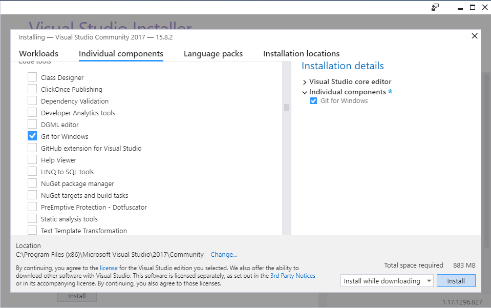

# Getting Started with Git Hands-On Lab
Part one of this series covers installation options and git usage from the command line as a local source control repository.  Future labs will cover topics such as working with remote repositories, being part of a team, and using tools.

## Selected Sections
[Installing Git](#installing-git)
[Start of Lab Walkthrough]()

## Meetup and Replay Information

### Recorded Live On Mixer
This lab will be presented live on **September 5th, 2018** at Philly.NET's Mixer channel: https://mixer.com/PhillyDotNet

The stream goes live around **5:45pm US EDT (UTC -4)** as we prepare the room for the in-person attendees.

We welcome everyone to join the Mixer chatroom and ask questions that will be relayed directly to the speaker.

### YouTube replay
This lab will be recorded and you may watch a replay of this meetup and lab at our YouTube channel. Please like the video so we know to produce more of this type of content.  Please subscribe to the channel to get updates whenever we add more content from our meetups and events!

YouTube Channel - https://www.youtube.com/PhillyDotNet

### Join the Philly.NET Meetup
For information on future streams and events, please be sure to join the meetup at:

https://www.meetup.com/Philly-NET/

## Prerequisites
You will need Git installed and ready to use from the command prompt or Powershell to follow along with this lab.

This lab installation guide covers Windows, but anyone with Git installed should be able to follow along.

This lab will not use any other tools.  Future labs will cover IDE integration and tools.

## Determine your current Git version

### Windows developers

You may determine if you have Git installed and ready to go for this lab by simply opening a Command Prompt or Powershell prompt and typing:

    git --version

If this returns output similar to `git version 2.17.1.windows.2`, then Git is already installed and ready to use in this lab.  This likely also means this is in your system PATH so that it can be used from anywhere you desire.

As of this writing, we recommend that Windows developers have at least 2.17.1(2) installed because of this security vulnerability disclosure: https://blogs.msdn.microsoft.com/devops/2018/05/29/announcing-the-may-2018-git-security-vulnerability/

## Installing Git

There are many ways to have Git installed on your machine.   Please read all of the options below and determine your best action:

### Install Visual Studio 2017
Download - (https://visualstudio.microsoft.com/vs/)

If you already have installed Visual Studio 2017 Community, Professional, or Enterprise, you may have already installed Git For Windows.  If not, and you plan to use Visual Studio 2017 on the device, this is a great option as the Visual Studio update process keeps Git updated as needed to remediate important fixes.

No matter what workload or other components you choose, make sure you have selected Git for Windows among Individual Components.

 

### Install Git for Windows yourself
As of this writing, the current version is 2.18.0. You can download an installer from: https://gitforwindows.org/

### Install from Chocolatey
Chocolatey is a package manager for Windows.  It installs quickly and automates installation of many tools and products you may use.

If you have Chocolatey you can simply use
    
    choco install git

Links: [Chocolatey Site](https://chocolatey.org) - [Chocolatey Install Information](https://chocolatey.org/install) - [Git for Windows package](https://chocolatey.org/packages/git)

# Lab Start - Getting Started with Git

## temp - reminder to self, what's NOT in here
* git pull, push, fetch
* git remote
* as many concepts as reasonable for foundation but always local

## temp - command line or powershell -
* git init
* git config (name and email)
* git add
* git status
* git commit
    * What is HEAD
    * commit, by convention, adds a new descendant to current HEAD ad moves HEAD pointer (sticky note pointers)
* (ugh text editor)
    * setting a different text editor
* git commit -m
* learning about git topic and text size "limits"
* git log
* git add -i
    * as an alternative to `git add .`

NOTE: (include `git log --oneline --abbrev-commit --all --graph --decorate --color`) but need a more complex repo
http://think-like-a-git.net/sections/graphs-and-git/visualizing-your-git-repository.html

## temp - git branch
* create branches
* moving back and forth
    * this is just moving HEAD
    * also involves fixing up "working area" (working tree)
* add commits to either
* move back and forth to show how git "fixes up" working folder
* what happens to unstaged or untracked files?
    * define unstaged files vs untracked files?
* git merge (bringing lines of development together)
    * examples that create merge commit (by default)
    * examples that fast forward
    * forcing what you want (either way)

## temp - how commits work
* commits are the key immutable building block of git
    * made of up pointers to blobs of files
    * avoid myth/misplaced concept that git "just stores the diffs"
* very very quick look at git under hood (maybe)
    * git commands dissect commits by hash and files associated with them
    * not practical per se... remove fear of git by showing how it works

## temp - resolving conflicts
* what git expects you to do to fix it

## temp - reset, revert
* git reset
    * all-purpose tool for moving pointers (branches or HEAD)
    * options decide what to do with working area or index (staging)
* git revert
    * new commit that undoes previous commit(s)
    

