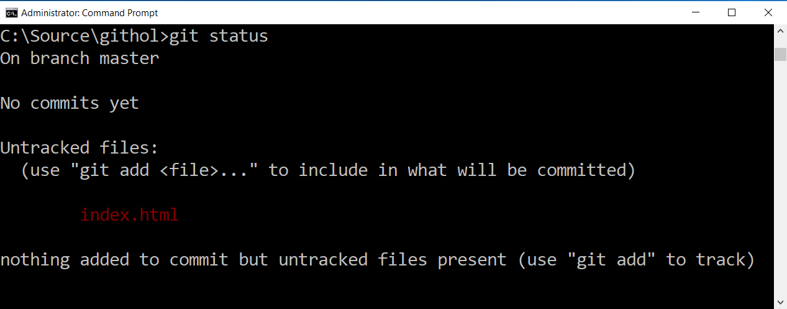
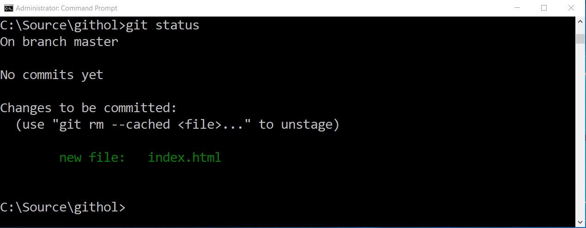
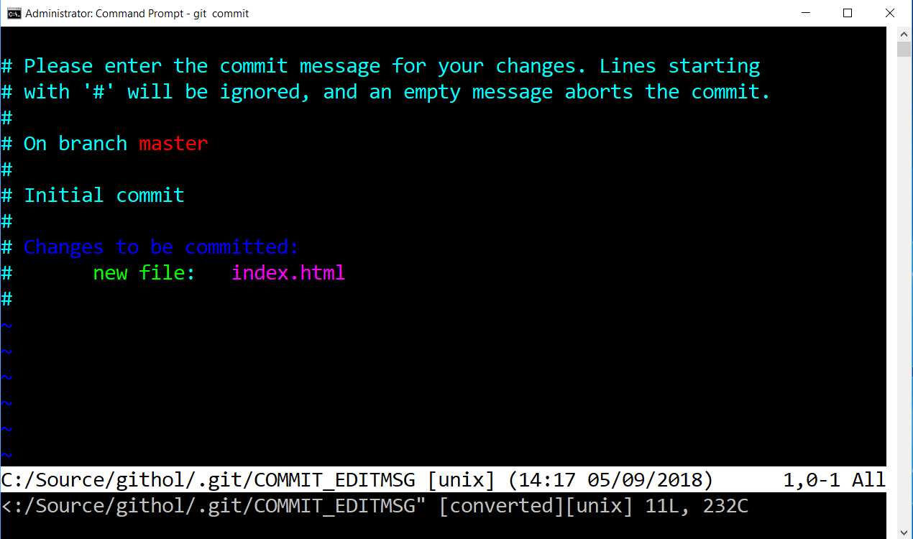
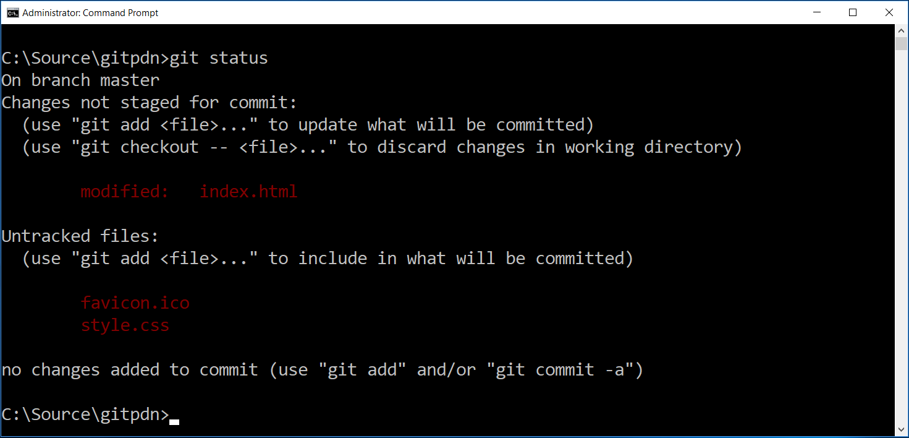

# Getting Started with Git Hands-On Lab
Part one of this series covers installation options and git usage from the command line as a local source control repository.  Future labs will cover topics such as working with remote repositories, being part of a team, and using tools.

## Jump to Sections of this README
[Installing Git](#installing-git)

[Start of Lab Walkthrough](#lab-start---getting-started-with-git)

## Meetup and Replay Information

### Recorded Live On Mixer
This lab will be presented live on **September 5th, 2018** at Philly.NET's Mixer channel: https://mixer.com/PhillyDotNet

The stream goes live around **5:45pm US EDT (UTC -4)** as we prepare the room for the in-person attendees.

We welcome everyone to join the Mixer chatroom and ask questions that will be relayed directly to the speaker.

### YouTube replay
This lab will be recorded and you may watch a replay of this meetup and lab at our YouTube channel. Please like the video so we know to produce more of this type of content.  Please subscribe to the channel to get updates whenever we add more content from our meetups and events!

YouTube Channel - https://www.youtube.com/PhillyDotNet

### Join the Philly.NET Meetup
For information on future streams and events, please be sure to join the meetup at:

https://www.meetup.com/Philly-NET/

## Prerequisites
### Git for Windows
You will need Git installed and ready to use from the command prompt or Powershell to follow along with this lab.

This lab installation guide covers Windows, but anyone with Git installed should be able to follow along.

This lab will not use any other tools.  Future labs will cover IDE integration and tools.

### Visual Studio Code (optional) 
https://code.visualstudio.com/download

We will demonstrate configuring a text editor for Git.  VS Code is convenient for this. 

## Determine your current Git version
### Windows developers
You may determine if you have Git installed and ready to go for this lab by simply opening a Command Prompt or Powershell prompt and typing:

    git --version

If this returns output similar to `git version 2.17.1.windows.2`, then Git is already installed and ready to use in this lab.  This likely also means this is in your system PATH so that it can be used from anywhere you desire.

As of this writing, we recommend that Windows developers have at least 2.17.1(2) installed because of this security vulnerability disclosure: https://blogs.msdn.microsoft.com/devops/2018/05/29/announcing-the-may-2018-git-security-vulnerability/

## Installing Git
There are many ways to have Git installed on your machine.   Please read all of the options below and determine your best action:

### Install Visual Studio 2017
Download - (https://visualstudio.microsoft.com/vs/)

If you already have installed Visual Studio 2017 Community, Professional, or Enterprise, you may have already installed Git For Windows.  If not, and you plan to use Visual Studio 2017 on the device, this is a great option as the Visual Studio update process keeps Git updated as needed to remediate important fixes.

No matter what workload or other components you choose, make sure you have selected Git for Windows among Individual Components.

 

### Install Git for Windows yourself
As of this writing, the current version is 2.18.0. You can download an installer from: https://gitforwindows.org/

### Install from Chocolatey
Chocolatey is a package manager for Windows.  It installs quickly and automates installation of many tools and products you may use.

If you have Chocolatey you can simply use
    
    choco install git

Links: [Chocolatey Site](https://chocolatey.org) - [Chocolatey Install Information](https://chocolatey.org/install) - [Git for Windows package](https://chocolatey.org/packages/git)

# Lab Start - Getting Started with Git

## Open Command Prompt or Powershell
We will not need the Git Bash shell.  You are free to use this shell, but Git for Windows has advanced to where it is no longer needed.

## Configuring Git for First Use
### Set name and email
Most Git GUI tools will prompt you for this if they detect nothing has been set, but since we're doing this all command line, you should configure your name and email address that will be applied to commits.

From the prompt enter these commands.  Use your own information:

`git config --global user.name "Philly.Net User Group"`

`git config --global user.email phillydotnet@example.com`

### Where was this saved?
On Windows, this is saved in your user profile in a text file called .gitconfig.  You could go edit this by hand if you chose.

You can see this file in the User Profile folder:
`start %userprofile%`

Git uses a cascading approach where it determines settings based on walking from the high machine level files to a local config file in your .git folder (as we will see later).

*Read more about First-Time Git Setup at the official documentation: https://git-scm.com/book/en/v2/Getting-Started-First-Time-Git-Setup*

## Create a new repository
* Go to an empty folder where you would be comfortable having a project.  For example, this lab will use C:\source\gitpdn

* Type `git init` in the empty folder

This doesn't get you much more than a .git hidden folder in your folder, but it is now a complete Git repository.

## Create a file
An easy way to create a file is to:
* Open your git repository in Visual Studio Code `code .`
* Create an index.html file
* Type an exclamation mark !
* Press *Tab* once.

Save this file (*Ctrl-S*) and you have something ready to stage.

## Adding untracked files
Git recognizes that you have a file it isn't storing or managing and lists it as an untracked file.

Use the following command to see this, as well as the overall status of your repository (we'll be using this a lot).

`git status`

 

Use the command *git add* to add your untracked file.  This is usually known as *staging* or more technically: *adding to the index*.

`git add index.html`

Another look at `git status` now shows:

## Commit the file
This can also be pretty simple.  Just use:

`git commit`

If you're new to Git, and haven't set a text editor of your own for Git, you will likely see this:

Learning Vim (and how to exit Vim) is outside the scope of this tutorial.  But we'll get through this.
* Hit the **I** key (for *insert mode*)
* Type `"Hello World"`
* Hit the *Escape* key
* Type `:x`
* Hit the *Enter* key

You have saved a commit with the message "Hello World" using Vim.  You have my condolences.

## Set a text editor
If you found the default editor annoying, you may like using Visual Studio Code as an editor.  You can set this globally with:

`git config --global core.editor "code --wait"`

For this to work, Visual Studio Code needs to be in the path on Windows.

You can actually set any editor you like by providing a command for the core.editor setting.

*Read complete instructions for using VSCode as your git Editor here: https://code.visualstudio.com/docs/editor/versioncontrol#_vs-code-as-git-editor*

*Read more about setting your text editor at First-Time Git Setup at the official documentation.  Look for the section "Your editor": https://git-scm.com/book/en/v2/Getting-Started-First-Time-Git-Setup*

## Add a second commit purely from command line
Let's make a second simple commit based on our first commit.

* Open the index.html file (you may already have it open in VSCode)
* Change something simple.  I'm going to edit the title node on line 7 to say: `<title>PDN Git is fun</title>`
* Save the file *(Ctrl-S)*
* Check the status of your repo: `git status`
* Add the modified file to the index (staging): `git add index.html`
* Feel free to `git status` again to see it's ready
* Now the all-in-one-commit without an editor: `git commit -m "Changed the Title"`

Congrats, you're building a commit graph (history).

## Explore git log
git log just shows you the log.  This is a powerful feature.  For example: remember this command line

`git log --oneline --abbrev-commit --all --graph --decorate --color`

## Add more commits
Add at least three more commits.  You may choose to use your shiny new text editor setting by using `git commit`
* Change index.html each time and save it
* Use `git add index.html` to add the file
* Use `git commit` (if you want your text editor to open) or use `git commit -m "Commit message"` to do it all from the prompt.

## What happens every time you git commit?
When you use `git commit`, Git does (mostly) the following things:
* It creates a new commit that points to the current HEAD commit
* It moves HEAD to point to this new commit
* If you are on a branch (in this case, master), it moves the branch pointer up to the new commit as well.

HEAD is the current commit that your workspace (your working area... your source folder) is deemed to be based on.  If you just commit all day, this is all very natural.  However, in the real world, we run into more complex problems, especially on teams.

## Adding more files with git add
If you go to the lab_files folder for the lab, you will find a few files that we can just copy into the source folder.  This just keeps us from having to create them.

* Copy in the lab files
* Link to them in the HTML by adding `<link rel="stylesheet" href="style.css">` to the `<head>` section of the web page.
* Type `git status`

It would be tedious to type `git add` for every file, so consider some options
* You can use wildcards such as `git add *.css`
* The ever infamous `git add .` - similar to git add --all (or -A)
* The peculiar `git add -i`

## git reset to "unstage" some files
Need to "unstage" some changes.  Use:
`git reset HEAD <file>`

or leave out the file specifier to unstage everything.

Once you have the files added, create a commit.

## git reset to move your branch pointer

`git reset` has multiple functions.  We just used it to take items out of staging.  

It is also useful when you want to move your current branch pointer to another commit.  It can quite literally be any commit in the repository.

This is useful to "take back" a commit (or commits) even make a simple change to your last commit (which you can also use git commit --amend for, and we'll show that next).

### git reset --soft to undo a commit, but leave working area and staging
Let's use `git reset --soft HEAD~1` to undo the last commit without changing in your working area.

This removed the commit, but it **left your working files as is and your staging area as it was**.  You could basically just commit again right now.

You could also do more work.  This is often useful if you've forgotten something and left it untracked and you don't want the mess of a pretty meaningless commit that says "oops".

* After using `git reset --soft`, add a new file.  Consider adding a new HTML page like before.  It doesn't matter that much.
* Stage the new file
* Use `git commit` to commit again.

### git reset --mixed to reset staging, but leave working area alone
* Use `git reset --mixed HEAD~1`
* Note that all staging was removed (`git status`) but your files in the working area are the way you left them
* Commit again

Before going onto the next section, add another file.  Leave this file untracked.

### git reset --hard to reset staging and working area to previous state
* Use `git reset --hard HEAD~1`
* Note that all staging was removed (`git status`) and your tracked files have been reverted to the state of this commit.
* Tracked files are removed
* Git does not care about untracked filse and does not touch them

